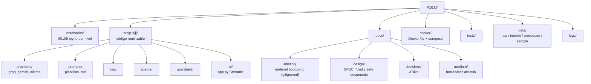
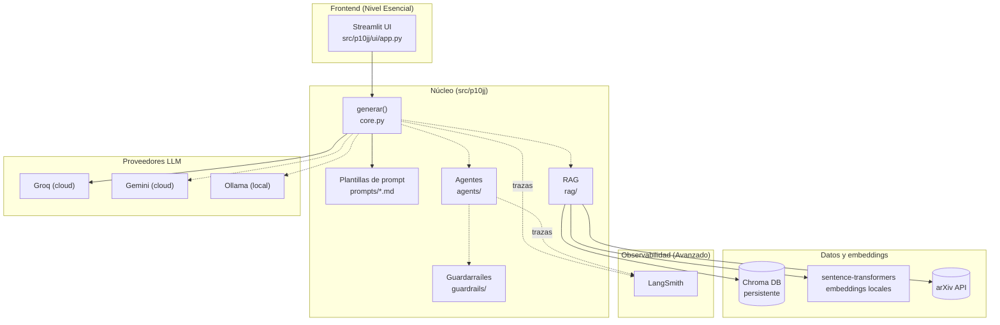
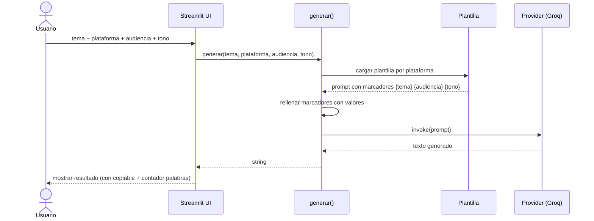
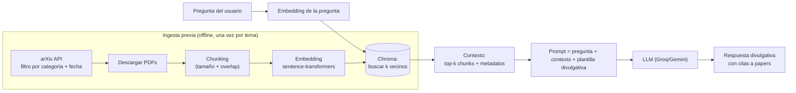
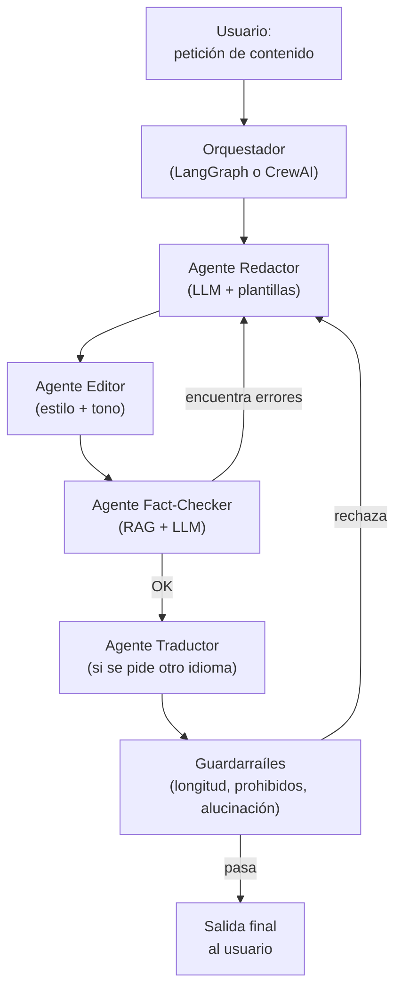

# Flujos de alto nivel — P10JJ

> Documento vivo. Visión a vista de pájaro del sistema completo. Las SPECs individuales (`SPEC_*.md`) profundizan en cada feature.
> Estado: Draft  |  Última revisión: 2026-06-08

---

## 1. Mapa del repositorio (qué hay dónde)

---

## 2. Arquitectura general

Componentes y sus relaciones. Las flechas continuas indican uso obligatorio en el nivel Esencial; las discontinuas son extensiones de niveles superiores.

---

## 3. Flujo principal — generación de contenido (Nivel Esencial)

El camino mínimo desde que el usuario escribe un tema hasta que ve texto en pantalla.

---

## 4. Evolución por niveles — qué se activa en cada uno

| Nivel | Frontend | Providers | Datos / RAG | Agentes | Observabilidad |
|---|---|---|---|---|---|
| Esencial | Streamlit simple | Groq | — | — | — |
| Medio | + selector provider, imágenes, dockerizado | + Gemini | — | — | — |
| Avanzado | + selector idioma | (igual) | + Chroma + arXiv + embeddings + multilenguaje + finanzas | — | **LangSmith** |
| Experto | (igual) | (igual) | + Graph RAG (grafo de conocimiento) | **multiagente + guardarraíles** | LangSmith |

Cada fila *suma* a la anterior; lo que se añade en un nivel no se quita en el siguiente.

### 4.1 Flujo RAG (Nivel Avanzado)

Cómo viaja una pregunta científica desde el usuario hasta una respuesta con citas a papers de arXiv.

### 4.2 Flujo Multiagente (Nivel Experto)

Varios agentes especializados colaboran. El orquestador decide el orden; los guardarraíles validan antes de publicar.

---

## 5. Flujo de desarrollo (cómo se construye cada feature)

El ciclo Gitflow simplificado del proyecto. Esto es lo que harás cada vez que abordes una issue.

```mermaid
flowchart LR
    I["Issue en GitHub<br/>(con label nivel:* y tipo:*)"] --> B["git checkout -b feature/slug"]
    B --> SP["Escribir SPEC_slug.md<br/>en docs/design/"]
    SP --> C["Codificar guiado por la SPEC"]
    C --> T["Tests + pre-commit local<br/>en verde"]
    T --> PUSH["git push"]
    PUSH --> PR["Abrir PR a develop<br/>(usa la plantilla)"]
    PR --> CI["pre-commit + CI<br/>en verde"]
    CI --> MERGE["Merge a develop"]
    MERGE --> CLOSE["Issue se cierra automáticamente<br/>(si el PR contiene 'Closes #N')"]
    CLOSE --> TAG{"¿Nivel completo?"}
    TAG -- "sí" --> REL["git tag v0.X.0-nivel<br/>+ push --tags"]
    TAG -- "no" --> NEXT["Siguiente issue"]
```

---

## Notas

- Los diagramas evolucionan: si una decisión técnica cambia, actualizamos este documento.
- Las flechas discontinuas indican componentes opcionales/avanzados.
- Cada feature relevante tendrá su propia `SPEC_*.md` con su diagrama de flujo específico (más detallado).
