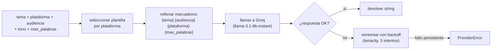

# SPEC: Generador de contenido base con LangChain + Groq

> Issue: #1  |  Nivel: Esencial  |  Estado: **Approved**
> Rama: feature/generador-base  |  Autor: JJ  |  Última revisión: 2026-06-11
> Sustituye a la v1 (Draft) del 2026-06-03

## 1. Objetivo en 1 frase

Generar un texto adaptado a una plataforma social a partir de un tema y una audiencia, usando Groq como único proveedor de LLM.

## 2. Por qué (contexto)

Primer entregable del Nivel Esencial. Establece el **kernel** sobre el que se construirán los demás niveles: selector de provider (Medio, #7), personalización (Medio, #8), RAG (Avanzado, #13) y multiagente (Experto, #15) usarán esta función como base. Sin esto no hay nada que ampliar.

## 3. Fuera de alcance (explícito)

- NO incluye Gemini ni otros proveedores (issue #7, Medio).
- NO incluye personalización por empresa/persona (issue #8, Medio).
- NO incluye imágenes (issue #9, Medio).
- NO incluye trazabilidad LangSmith (issue #10, Avanzado).
- NO incluye multilenguaje (issue #11, Avanzado).
- NO incluye RAG ni recuperación externa (issue #13, Avanzado).
- NO incluye UI: solo función backend invocable desde notebook o Python (issue #3, Esencial UI).
- **NO mide la calidad subjetiva del texto generado** (será trabajo de guardarraíles, issue #16, Experto).

## 4. Flujo



## 5. Contratos / interfaces

```python
# src/p10jj/core.py

from typing import Literal

Plataforma = Literal["blog", "twitter", "instagram", "linkedin"]
Audiencia  = Literal["general", "tecnica", "infantil", "ejecutiva"]

# Defaults de longitud por plataforma (palabras aproximadas)
DEFAULTS_MAX_PALABRAS: dict[str, int] = {
    "blog":      800,
    "linkedin":  200,
    "instagram": 100,
    "twitter":    40,  # margen sobre los 280 caracteres de X
}


def generar(
    tema: str,
    plataforma: Plataforma,
    audiencia: Audiencia = "general",
    tono: float = 0.7,
    max_palabras: int | None = None,
) -> str:
    """Genera contenido adaptado a la plataforma y audiencia indicadas.

    Args:
        tema: asunto principal del contenido.
        plataforma: determina la plantilla aplicada y la longitud por defecto.
        audiencia: nivel y registro del texto.
        tono: float en [0.0, 1.0]. Se pasa COMO temperature al modelo.
            NO se usa como marcador del prompt. Fuera de rango: ValueError.
        max_palabras: si None, se usa DEFAULTS_MAX_PALABRAS[plataforma].
            Se pasa al prompt como guia. No se valida en post-proceso.

    Returns:
        Texto generado en castellano, listo para publicar.

    Raises:
        ValueError: si `tono` esta fuera de [0.0, 1.0] o si valores Literal no validos.
        ProviderError: si la API de Groq falla tras 3 reintentos.
    """
```

### Excepcion especifica

```python
# src/p10jj/providers/groq.py

class ProviderError(RuntimeError):
    """Lanzada cuando el proveedor LLM falla tras los reintentos configurados.

    Attributes:
        mensaje (str): descripcion legible del fallo.
        ultimo_error (Exception | None): la ultima excepcion capturada.
    """
    def __init__(self, mensaje: str, ultimo_error: Exception | None = None):
        super().__init__(mensaje)
        self.mensaje = mensaje
        self.ultimo_error = ultimo_error
```

### Ejemplo de uso

```python
from p10jj.core import generar

texto = generar(
    tema="Cómo elegir un IDE en 2026",
    plataforma="linkedin",
    audiencia="tecnica",
    tono=0.5,
)
print(texto)
```

## 6. Datos

- **Entrada**: argumentos directos a `generar(...)`. No lee de disco salvo las plantillas.
- **Salida**: `str` en castellano, listo para publicar.
- **Persistencia**: ninguna. La trazabilidad LangSmith se activa en el Nivel Avanzado (issue #10).
- **Plantillas**: archivos `src/p10jj/prompts/<plataforma>.md` (4 archivos, codificacion **UTF-8**).
- **Estructura comun** de las 4 plantillas (decidida en sub-bloque 4.3.2):

  ```
  Eres un redactor especializado en {plataforma}.
  Tema: {tema}
  Audiencia: {audiencia}
  Longitud aproximada: {max_palabras} palabras.

  Genera el contenido en castellano, siguiendo las convenciones de {plataforma}.
  [Instrucciones especificas de la plataforma]
  ```

- **Marcadores obligatorios** en las 4 plantillas: `{tema}`, `{audiencia}`, `{plataforma}`, `{max_palabras}`.
- **Idioma**: castellano hardcoded (multilenguaje queda para issue #11).

## 7. Decisiones tomadas

- **Modelo**: `llama-3.1-8b-instant`. Verificado **Production** en GroqCloud a junio 2026 (sub-bloque 4.3.0). ~560 t/sec, free tier 14.4K RPD: mucho margen.
- **Provider**: `langchain-groq` 1.1.1 (versión actual en PyPI a junio 2026). API estable, sin breaking changes desde enero 2026.
- **Alternativa futura para comparativa**: `openai/gpt-oss-20b` (free, ~1000 t/sec) — se evaluara en la issue #7 (Medio).
- **Reintentos**: `tenacity` con 3 intentos y backoff exponencial. Cubre 429 (rate limit) y 5xx transitorios.
- **Temperatura default**: 0.7 (equilibrio creatividad/determinismo).
- **Plantillas en `.md`**: legibles, editables sin tocar codigo.
- **Tipos `Literal`** en las firmas: errores tempranos por valores no soportados, sin libreria extra.
- **Estrategia de tests (sub-bloque 4.3.3)**: MIXTO
  - Unitarios con mock de ChatGroq por defecto (rapidos, sin cuota).
  - Tests de integracion marcados `@pytest.mark.integration`, opt-in con `pytest -m integration`.
- **Cobertura**: `pytest-cov` con `--cov-report=term-missing`, **sin** `--cov-fail-under`.
- **Notebook**: `nbval --nbval-lax` marcado `@integration`.
- **Castellano hardcoded**: las plantillas estan en castellano, sin parametro `idioma`.

## 8. Alternativas descartadas

- **Llamadas REST directas** a Groq sin LangChain: LangChain es requisito del bootcamp.
- **Multiples modelos en esta feature**: scope estrecho; la eleccion de modelos y >=2 providers es la issue #7.
- **Plantillas en codigo Python**: menos legibles, peor iteracion rapida.
- **Estructura libre por plantilla** (B en 4.3.2): adelantaba personalizacion propia de #8.
- **Marcador `{tono}` o `{estilo_textual}`** en el prompt: `tono` queda solo como temperature; estilo textual queda para #8.
- **Tests solo integracion** (B en 4.3.3): lento, consume cuota, fragil en CI.
- **Cobertura >=80% con `--cov-fail-under`**: prematuro para primera feature.

## 9. Riesgos y mitigaciones

- **Cuota free agotada** durante pruebas → llama-3.1-8b-instant tiene 14.4K RPD: muchisimo margen. Si aun asi: esperar al reset diario.
- **Modelo deprecated por Groq** (ya paso en 2026 con Llama 4 Maverick y Kimi K2): mitigacion → constante `MODEL` centralizada en `src/p10jj/providers/groq.py`. Un unico cambio para migrar.
- **Plantillas desincronizadas**: `tests/test_plantillas.py` verifica marcadores y codificacion.
- **Filtracion de `GROQ_API_KEY`**: `.env` en `.gitignore` + `gitleaks` en pre-commit. Si filtracion: revocar en Groq console + nueva clave + invalidar la vieja.

## 10. Definition of Done (criterios verificables)

### Implementacion

- [ ] `src/p10jj/core.py::generar(...)` existe con la firma del punto 5.
- [ ] `src/p10jj/providers/groq.py::get_groq_llm(...)` existe con tenacity.
- [ ] 4 plantillas creadas en `src/p10jj/prompts/`: `blog.md`, `twitter.md`, `instagram.md`, `linkedin.md` en **UTF-8**.
- [ ] `DEFAULTS_MAX_PALABRAS` expone `{blog: 800, linkedin: 200, instagram: 100, twitter: 40}`.

### Tests unitarios (rapidos, sin Groq)

- [ ] `tests/test_generar.py::test_invoca_provider_y_devuelve_string` pasa.
- [ ] `tests/test_generar.py::test_lanza_value_error_si_tono_fuera_de_rango` pasa.
- [ ] `tests/test_generar.py::test_lanza_provider_error_tras_3_fallos` pasa.
- [ ] `tests/test_plantillas.py::test_todas_las_plantillas_tienen_marcadores` pasa.
- [ ] `tests/test_plantillas.py::test_plantillas_son_utf8` pasa.
- [ ] `pytest` (sin flags) pasa en verde.

### Tests de integracion (opt-in con `pytest -m integration`)

- [ ] `tests/test_generar_integration.py::test_genera_string_real` pasa (consume cuota Groq).
- [ ] `tests/test_notebook_esencial.py::test_notebook_ejecuta` pasa con nbval-lax.

### Cobertura

- [ ] `pytest --cov=p10jj` imprime el reporte de cobertura en terminal.

### Notebook

- [ ] `notebooks/01_esencial_prompts.ipynb` ejecuta sin errores con "Restart & Run All".
- [ ] El notebook llama a `generar(...)` con las 4 plataformas.

### Configuracion

- [ ] `pyproject.toml`: deps anadidas (`langchain-groq`, `tenacity`, `pytest-cov`, `nbval`).
- [ ] `pyproject.toml`: marker `integration` registrado.
- [ ] `.env.example` incluye `GROQ_API_KEY=`.

### Documentacion

- [ ] `README.md` seccion "Uso" incluye 3 lineas de quick-start de `generar(...)`.

### Gestion

- [ ] PR con labels: `nivel:esencial`, `tipo:feature`, `area:providers`, `prioridad:alta`.
- [ ] PR fusionado a develop.
- [ ] Issue #1 cerrada por el merge del PR (mediante "Closes #1" en el cuerpo del PR).

## 11. Apendice — Plan de implementacion (10 pasos, decidido en 4.3.4)

Para cuando arranque la rama `feature/generador-base`. Cada paso = un turno de trabajo: archivo o comando concreto, ejecuto-pego-confirmo-siguiente.

```
0.  Spike Groq (5 min, no se commitea): verificar API key + modelo vivo.
1.  pyproject.toml: deps + markers + cov + uv sync.
2.  Test unitario en rojo (test_invoca_provider_y_devuelve_string).
3.  core.py minimo en verde.
4.  Plantillas (4 .md) + test de plantillas en verde.
5.  Conectar plantillas con core.py.
6.  providers/groq.py + tenacity para reintentos.
7.  Test de integracion (@integration) en verde con pytest -m integration.
8.  notebooks/01_esencial_prompts.ipynb.
9.  Test del notebook con nbval (@integration).
10. README quick start + git push → PR → merge → cerrar issue #1.
```

---

> SPEC v2 cerrada en el Bloque 4.3 del proyecto. Cierra los sub-bloques 4.3.0 a 4.3.4.
> v1 (Draft del 2026-06-03) archivada localmente en `docs/old_versions/` (gitignored).
