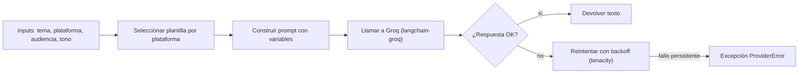

# SPEC: Generador de contenido base con LangChain + Groq

> Issue: #1  |  Nivel: Esencial  |  Estado: Draft
> Rama: feature/generador-base  |  Autor: JJ  |  Última revisión: 2026-06-03

## 1. Objetivo en 1 frase
Generar un texto adaptado a una plataforma social a partir de un tema y una audiencia, usando Groq como único proveedor de LLM.

## 2. Por qué (contexto)
Primer entregable del **Nivel Esencial** del bootcamp. Establece la columna vertebral del proyecto: la función `generar(tema, plataforma, audiencia)` que el resto de funcionalidades (UI Streamlit, segundo proveedor, RAG, multiagente) ampliarán o usarán. Sin esto no hay ninguna otra feature posible.

## 3. Fuera de alcance (explícito)
- NO incluye Gemini ni otros proveedores (eso es la issue #7).
- NO incluye personalización por empresa/persona (issue #8).
- NO incluye imágenes (issue #9).
- NO incluye RAG ni recuperación de información externa (issue #13).
- NO incluye UI: solo función backend invocable desde notebook o Python. La UI Streamlit es la issue #3.

## 4. Flujo



## 5. Contratos / interfaces

```python
# src/p10jj/core.py

from typing import Literal

Plataforma = Literal["blog", "twitter", "instagram", "linkedin"]
Audiencia  = Literal["general", "tecnica", "infantil", "ejecutiva"]

def generar(
    tema: str,
    plataforma: Plataforma,
    audiencia: Audiencia = "general",
    tono: float = 0.7,
    max_palabras: int | None = None,
) -> str:
    """Genera contenido adaptado a la plataforma y audiencia indicadas.

    - `tema`: asunto principal del contenido.
    - `plataforma`: determina la plantilla aplicada (longitud, formato).
    - `audiencia`: tono y nivel de detalle.
    - `tono`: 0.0 = determinista, 1.0 = creativo.
    - `max_palabras`: corte aproximado de longitud.
    Lanza ProviderError si la API falla tras 3 reintentos.
    """
```

## 6. Datos
- **Entrada**: argumentos directos (no lee de disco).
- **Salida**: cadena de texto plana, lista para mostrar/publicar.
- **Persistencia**: ninguna en esta feature. (LangSmith trazará cuando se active en el Nivel Avanzado.)
- **Plantillas**: archivos `src/p10jj/prompts/<plataforma>.md` con marcadores `{tema}`, `{audiencia}`, `{tono}`. Los lee la función al arrancar.

## 7. Decisiones tomadas
- **Modelo**: `llama-3.1-8b-instant`. Es el más rápido en el free tier de Groq; suficiente calidad para Esencial.
- **Reintentos**: `tenacity` con 3 intentos y backoff exponencial. Cubre los errores transitorios típicos (429, 5xx).
- **Plantillas como `.md`**: legibles y editables sin tocar código. Una por plataforma.
- **Tipos `Literal`**: errores tempranos por valores no soportados, sin librería extra.

## 8. Alternativas descartadas
- **Llamadas directas a la API REST de Groq** sin LangChain: descartado porque LangChain es requisito del bootcamp.
- **Múltiples modelos en esta feature**: descartado para mantener scope estrecho. La elección de modelo y el ≥2 proveedores son la issue #7.
- **Plantillas en código Python**: descartado por menor legibilidad y por dificultar la iteración rápida sobre prompts.

## 9. Riesgos y mitigaciones
- **Cuota gratuita de Groq agotada** durante pruebas → cache local con LRU pequeño + mensaje claro de error con sugerencia de esperar.
- **Modelo cambia o se retira** en Groq → constante `MODEL` centralizada en `src/p10jj/providers/groq.py`; un solo punto de cambio.
- **Plantillas se desincronizan** con la función → tests que carguen cada plantilla y comprueben que tiene todos los marcadores esperados.

## 10. Definition of Done (criterios verificables)
- [ ] `src/p10jj/core.py::generar(...)` existe con la firma del punto 5.
- [ ] 4 plantillas creadas: `prompts/blog.md`, `prompts/twitter.md`, `prompts/instagram.md`, `prompts/linkedin.md`.
- [ ] Test `tests/test_generar.py` que llama a `generar(...)` con un mock del provider y comprueba que no lanza excepción y devuelve string no vacío.
- [ ] Test que valida que cada plantilla tiene los marcadores `{tema}`, `{audiencia}`, `{tono}`.
- [ ] `notebooks/01_esencial_prompts.ipynb` (creado en issue #4) puede importar y llamar `generar(...)`.
- [ ] README actualizado con un mini "Quick start" mostrando 3 líneas de uso.
- [ ] PR con label `nivel:esencial,tipo:feature,area:providers,prioridad:alta` fusionado a develop.
- [ ] Issue #1 cerrada.
