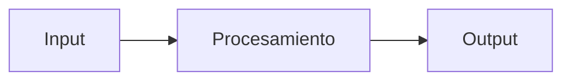

# SPEC: <título corto y descriptivo>
<!--
  El título debe coincidir o parecerse al título de la issue de GitHub.
  Ejemplo issue #1: "feat(core): generador de contenido base con LangChain + Groq"
  Título spec:      "Generador de contenido base con LangChain + Groq"
-->

> Issue: #<n>  |  Nivel: <Esencial/Medio/Avanzado/Experto>  |  Estado: Draft / Approved / Done
> Rama: feature/<slug>  |  Autor: JJ  |  Última revisión: <YYYY-MM-DD>
<!--
  Issue:    el número de GitHub. Ejemplo: #1
  Nivel:    cuál de los 4 niveles del bootcamp cubre esta feature.
  Estado:   Draft = en redacción.  Approved = revisada y aprobada (idealmente 24h después).
            Done = todas las cajas del DoD marcadas, PR fusionado, issue cerrada.
  Rama:     la rama Git donde se trabaja. feature/<slug-corto>.
  Autor:    quién la escribió.
  Fecha:    para ver si la spec está desactualizada respecto al código.
-->

## 1. Objetivo en 1 frase
<!--
  UNA frase, clara, en presente. Si necesitas más de una, divide la feature.
  Bien: "Generar texto para una plataforma social a partir de tema y audiencia,
         usando Groq."
  Mal:  "Crear el sistema completo de generación que cubrirá blogs, redes,
         multilenguaje, RAG, etc."  ← esto son 5 features.
-->

## 2. Por qué (contexto)
<!--
  2-4 frases. Responde:
    - ¿Para qué sirve?
    - ¿Qué problema resuelve?
    - ¿En qué nivel del bootcamp encaja?
  Si te cuesta justificarlo, quizá la feature no merezca el esfuerzo todavía.
-->

## 3. Fuera de alcance (explícito)
<!--
  AQUÍ se gana o se pierde el control del proyecto.
  Escribe explícitamente lo que NO vas a hacer EN ESTA FEATURE.
  Cosas que probablemente otras features cubrirán: lo dices aquí.
  Ejemplo para issue #1 (generador base):
    - NO incluye soporte para Gemini (eso es issue #7).
    - NO incluye personalización por empresa (eso es issue #8).
    - NO incluye imágenes (eso es issue #9).
-->
- <cosa que NO va a hacer en esta feature>
- <cosa que NO va a hacer en esta feature>

## 4. Flujo
<!--
  Diagrama Mermaid del flujo de la feature.
  GitHub lo renderiza solo cuando miras el .md en la web.
  Sintaxis básica:
    flowchart LR  → izquierda a derecha
    A[Caja]       → caja rectangular
    A --> B       → flecha de A a B
    A{Decisión?}  → rombo de decisión
    A --|sí|--> B → flecha etiquetada
  El "LR" puede ser TD (top-down).
-->



## 5. Contratos / interfaces
<!--
  Aquí defines QUÉ puede usarse desde fuera, sin contar cómo está hecho por dentro.
  Es la "API pública" de tu feature. Si esto cambia, otras partes del código se
  rompen; por eso conviene fijarlo aquí antes.

  Para Python: la firma de las funciones públicas y sus docstrings.
  Para datos:  el formato de un fichero o de una respuesta JSON.
  Para UI:     los componentes y sus parámetros.
-->

```python
def funcion(param: tipo) -> tipo:
    """Una línea explicando QUÉ hace, no cómo."""
```

## 6. Datos
<!--
  Qué estructuras manejas, qué se guarda y dónde.
  - ¿Formato de entrada? (texto, JSON, dataclass...)
  - ¿Formato de salida?
  - ¿Algo se persiste en disco / BD / Chroma?
-->

## 7. Decisiones tomadas
<!--
  Las decisiones no triviales que tomaste mientras escribías la spec.
  Razón breve por cada una.
  Ejemplo:
    - Usar Groq con llama-3.1-8b-instant: el modelo gratis más rápido para iterar.
    - Temperatura 0.7 por defecto: equilibrio entre creatividad y reproducibilidad.
-->

## 8. Alternativas descartadas
<!--
  Lo que pensaste y NO elegiste, y por qué.
  Sirve para que si dentro de 2 semanas te preguntas "¿por qué no hicimos X?",
  encuentres aquí la respuesta sin repetir el debate.
-->

## 9. Riesgos y mitigaciones
<!--
  Lo que puede salir mal y qué harás si pasa.
  Ejemplo:
    - Riesgo: Groq agota cuota gratuita en pruebas → mitigación: cache de respuestas
      en local + fallback a Gemini.
-->

## 10. Definition of Done (criterios verificables)
<!--
  CAJITAS verificables. Cuando todas estén marcadas, la feature está hecha.
  Cada caja debe ser comprobable por alguien que no eres tú.
  "Funciona bien" NO es verificable.
  "Test test_generar_blog_post pasa en CI" SÍ es verificable.
-->
- [ ] Test que demuestra <X>
- [ ] Documentación actualizada en <Y>
- [ ] Notebook ejecuta de cabo a rabo (si aplica)
- [ ] PR con label correspondiente fusionado a develop
- [ ] Issue cerrada
