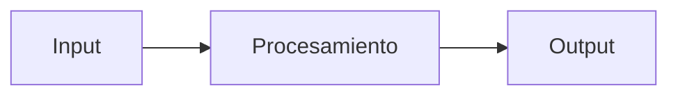

# SPEC: <título corto y descriptivo>

> Issue: #<n>  |  Nivel: <Esencial/Medio/Avanzado/Experto>  |  Estado: Draft / Approved / Done
> Rama: feature/<slug>  |  Autor: JJ  |  Última revisión: <YYYY-MM-DD>

## 1. Objetivo en 1 frase
<Una sola frase. Si no cabe en una, la feature es demasiado grande: divídela.>

## 2. Por qué (contexto)
<2-4 frases. Para qué sirve, a quién beneficia, qué problema resuelve.>

## 3. Fuera de alcance (explícito)
- <cosa que NO va a hacer en esta feature>
- <cosa que NO va a hacer en esta feature>

## 4. Flujo



## 5. Contratos / interfaces

```python
def funcion(param: tipo) -> tipo:
    """Una línea de qué hace."""
```

## 6. Datos
<Estructuras clave, formato de entrada/salida, qué se persiste y dónde.>

## 7. Decisiones tomadas
- <Decisión 1 + breve razón>
- <Decisión 2 + breve razón>

## 8. Alternativas descartadas
- <Alternativa + por qué no>

## 9. Riesgos y mitigaciones
- <Riesgo> → <mitigación>

## 10. Definition of Done (criterios verificables)
- [ ] Test que demuestra <X>
- [ ] Documentación actualizada en <Y>
- [ ] Notebook ejecuta de cabo a rabo (si aplica)
- [ ] PR con label correspondiente fusionado a develop
- [ ] Issue cerrada
